## OpenDesk Admin Manual

### I. Overview

OpenDesk is an open source VDI management system based on Proxmox.

### II. Login

Enter the IP address of the OpenDesk virtual machine in your browser to log in. Default username: admin, default password: opendesk. Supports English, Japanese, Chinese (Simplified), and Chinese (Traditional) languages.

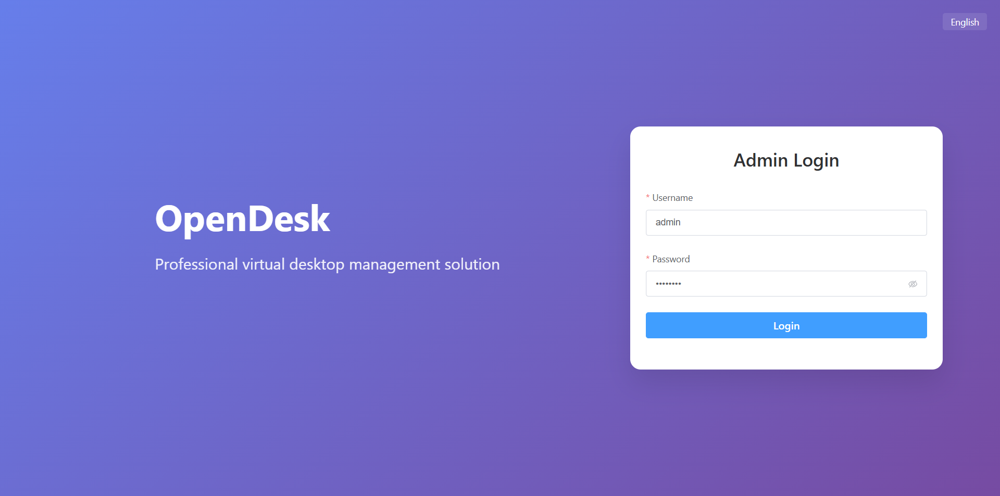

### III. Configure Proxmox

Enter the relevant parameters in the PVE configuration under System Settings, then save to take effect.

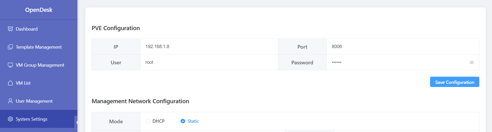

### IV. Configure Management System IP

Enter the relevant parameters in the Management Network configuration under System Settings. Static mode is recommended. Save and the virtual machine will automatically restart to take effect.

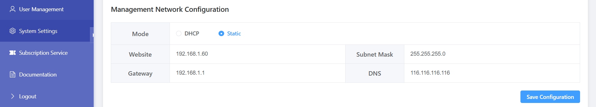

### V. Configure Gateway Proxy

Gateway proxy service is enabled by default. For connection security, even if the gateway configuration is empty, the default connection will still use the gateway. Users only need to configure TCP ports in the firewall. Note: Fill in the external proxy information.

Example:

Public proxy: https://192.168.1.60:9443 -> https://vdi.com:19443

Internal proxy: https://192.168.1.60:8443 -> https://192.168.1.30:18443

Note: If using nginx proxy, please use nginx-full stream mode.

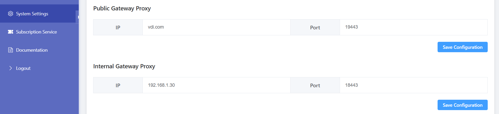

### VI. Change Admin Password

Note: If you expose the service to the public network, be sure to change the admin password.

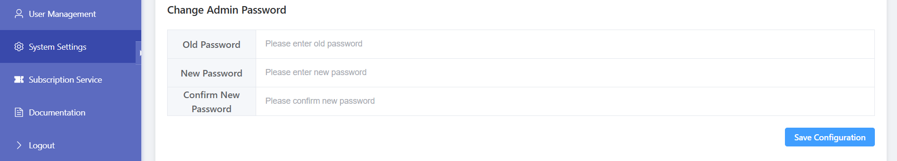

### VII. Dashboard

View Proxmox running information.

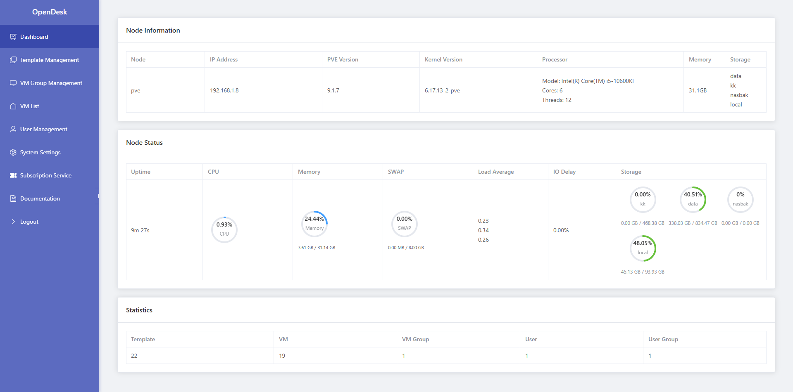

### VIII. Template Management

Only template deletion is supported.

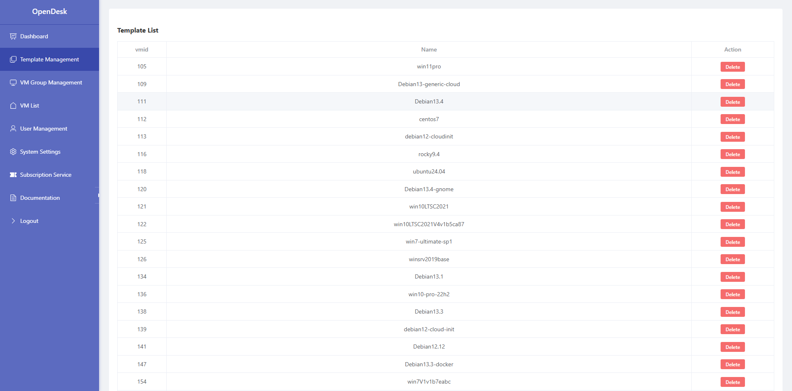

### IX. VM Group Management

Group VMs for batch management. Supports create, restore, rebuild, and delete operations.

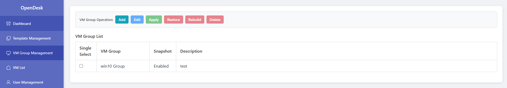

#### Add VM Group

Click the Add button to add VM group information.

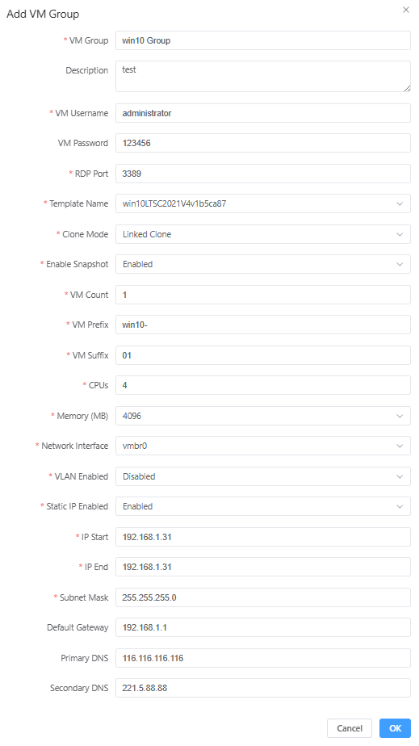

Note: If the VM password is empty, a 16-digit random password will be generated. Random passwords are recommended.

#### Apply VM Group

Select the VM group to create and click the Apply button to start creation according to the configuration.

#### Restore VM Group

If the VM group has snapshots, click the Restore button. All VMs in the VM group will be restored.

#### Rebuild VM Group

Click the Rebuild button. All VMs in the VM group will be deleted and recreated.

#### Delete VM Group

Click the Delete button. All VMs in the VM group will be deleted.

### X. VM List

View the running status of all VMs and perform operations on VMs.

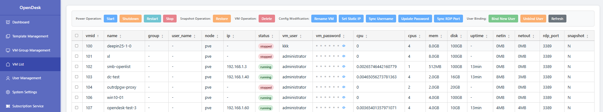

Note: Sync username and sync RDP port will not modify VM configuration, only sync related configurations in the database.

### XI. User Management

User group management for unified administration.

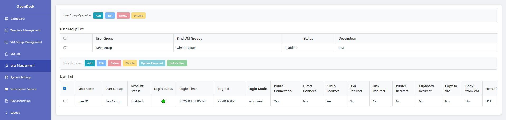

#### Add User Group

Add a user group and bind it to a VM group.

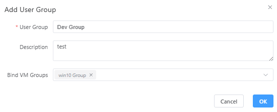

#### Edit User Group

Edit user group configuration.

#### Delete User Group

Delete user group.

#### Disable/Enable User Group

Disable or enable user group.

#### Add Users

Batch add users, bind to corresponding user groups, and configure connection policies.

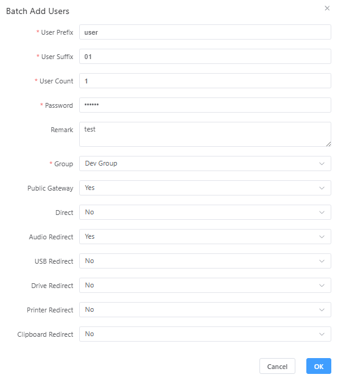
