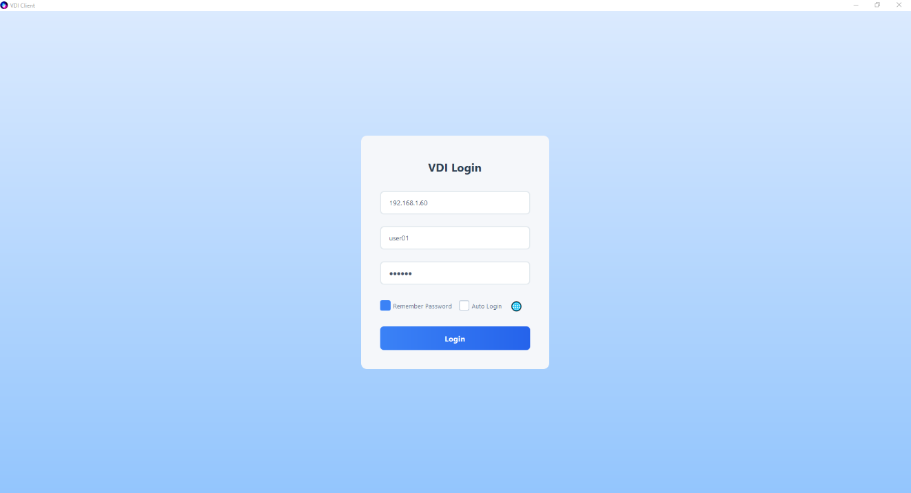
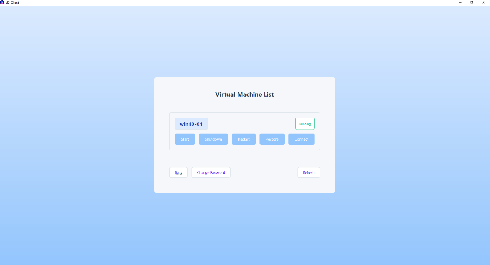
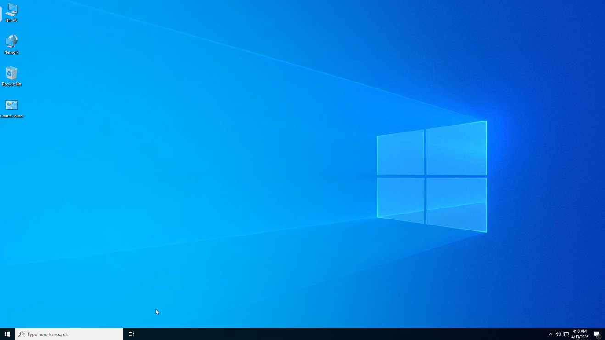
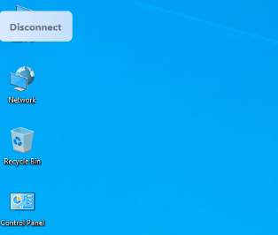
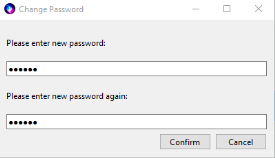
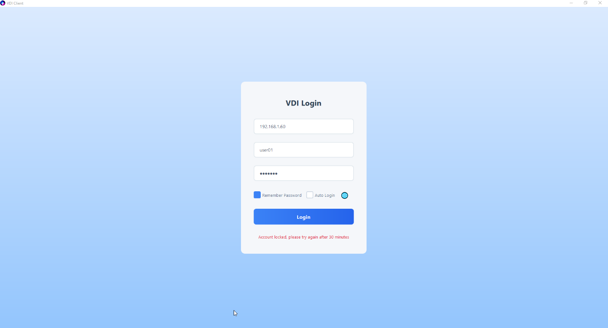

## VDI Client User Guide

### I. Overview

VDI Client is a VDI client based on Qt + FreeRDP.

### II. Login

Enter the server IP, username and password, then click login. Supports English, Japanese, Chinese (Simplified), and Chinese (Traditional) languages.

### III. Connect

Click the Connect button to login to the virtual machine.

Click the floating button in the top-left corner to disconnect. The floating button supports docking to top, bottom, left, or right edges.

User shutdown or restart will also cause disconnection.

### IV. Change User Password

Click the Change Password button to modify your password.

### V. Operate Virtual Machine

After clicking Power On, Shutdown, Restart, or Restore (only available in restore mode), use the Refresh button to update VM status. After VM power on or restart operations, users need to wait approximately 10-15 seconds before clicking Connect to enter the VM, otherwise connection failure will occur.

### VI. User Lockout

Entering wrong password 5 times will result in user lockout. Please contact the administrator to unlock.

