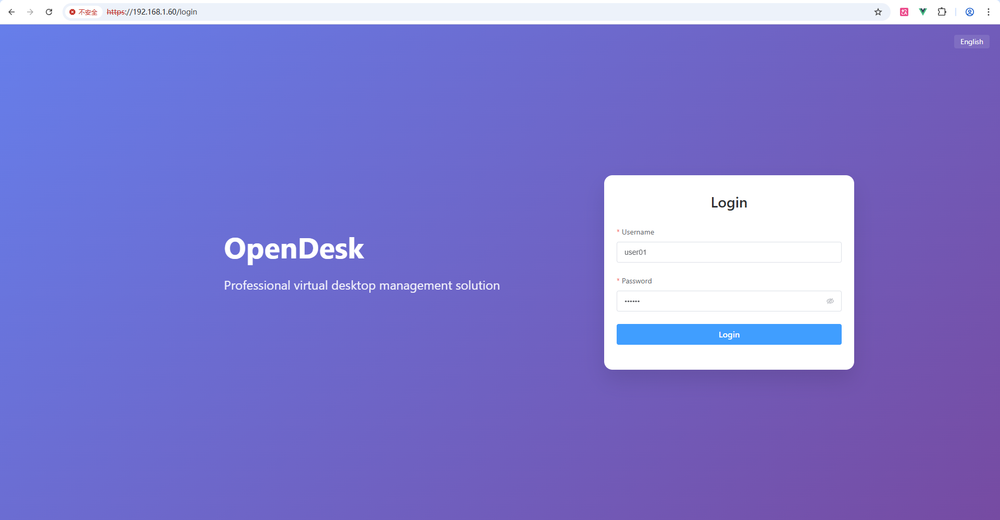
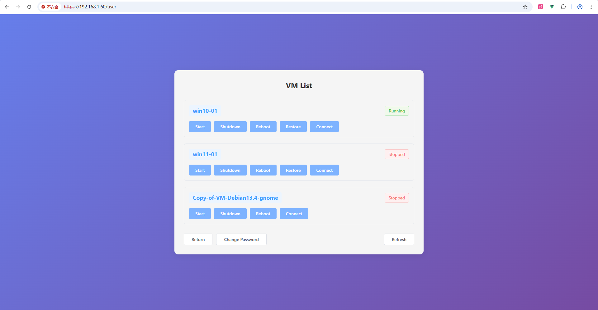
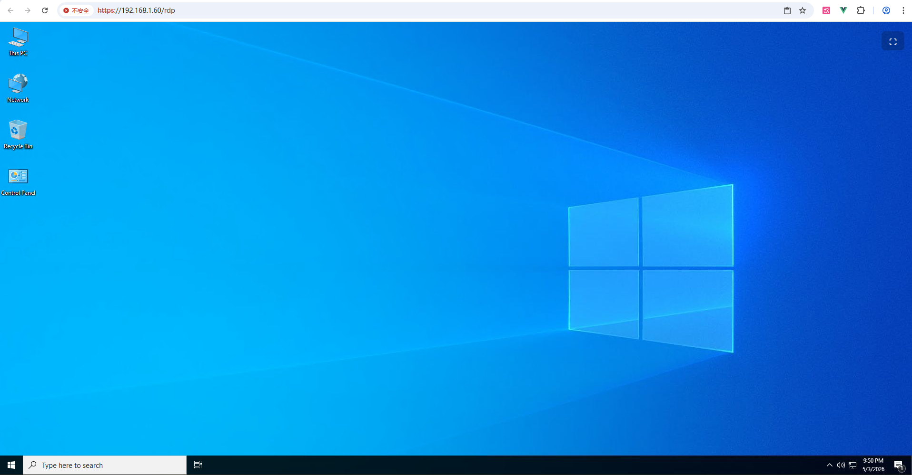
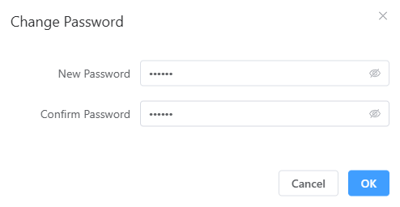
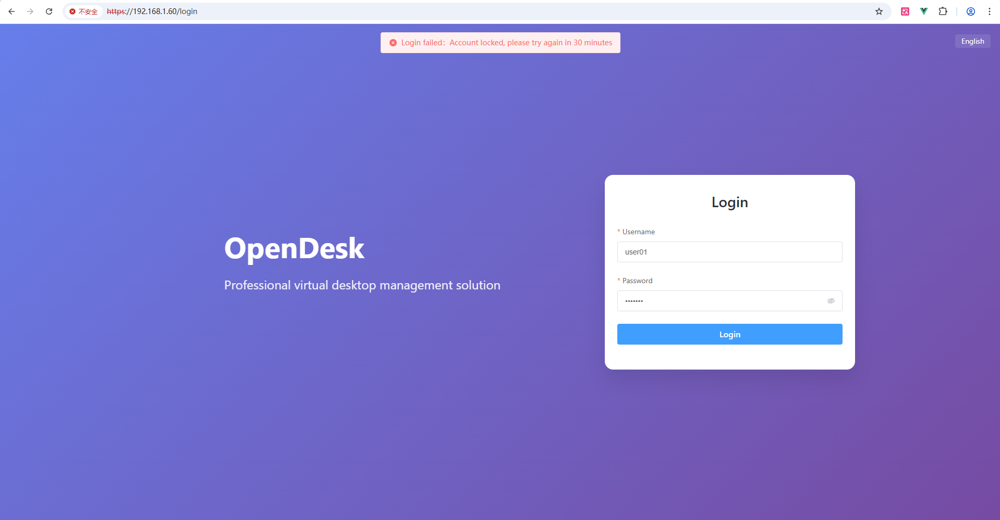

## Browser Login Mode

### 1. Overview

OpenDesk has a built-in Guacamole gateway, allowing you to login to virtual machines through a browser.

### 2. Login

Enter the IP address of OpenDesk in your browser, then enter your username and password to login. Supports English, Japanese, Chinese (Simplified and Traditional) multiple languages.

### 3. Connection

Click the Connect button to login to the virtual machine.

Click the floating button on the right to enter fullscreen mode. The floating button can be freely moved.

### 4. Change User Password

Click the Change Password button to modify your password.

### 5. Virtual Machine Operations

Click the Start, Shutdown, Restart, or Restore (only available in restore mode configuration) buttons, then use the Refresh button to update the virtual machine status. After starting or restarting the virtual machine, please wait approximately 10-15 seconds before clicking Connect, otherwise a connection failure prompt will appear.

### 6. User Lockout

Entering 5 incorrect passwords will result in user lockout. Please contact an administrator to unlock your account.

