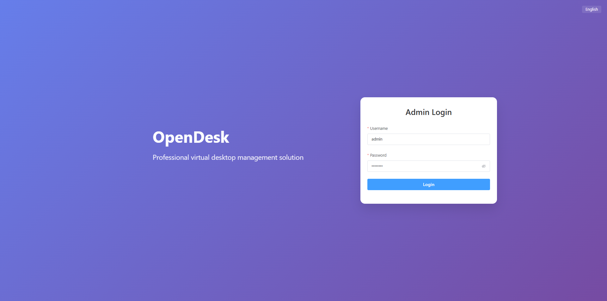

import { Card } from '@site/src/components/ui';

##  OpenDesk

---

## ✨ Product Introduction

<Card>

OpenDesk is dedicated to providing lightweight, efficient, and well-scalable desktop cloud solutions for small and medium-sized enterprises.

Based on PVE virtualization architecture, the system adopts a modular design concept, ensuring simplicity in deployment and usage while offering flexible scalability to smoothly upgrade with business growth.

Through a unified web management platform, administrators can centrally manage users, resources, and permissions with precision, while real-time monitoring of virtual machine operational status and user login activities.

</Card>

---

## 🔐 Security and Operations

<Card>

In terms of security and performance, OpenDesk integrates identity authentication and permission control mechanisms, combined with RD Gateway to achieve secure access, effectively ensuring the stability and reliability of remote desktop connections.

The system also provides comprehensive operation monitoring and status awareness capabilities, helping operation personnel quickly locate issues and optimize resource configuration. The overall solution reduces deployment and operation costs while improving the availability and user experience of the desktop cloud environment.

</Card>

---
