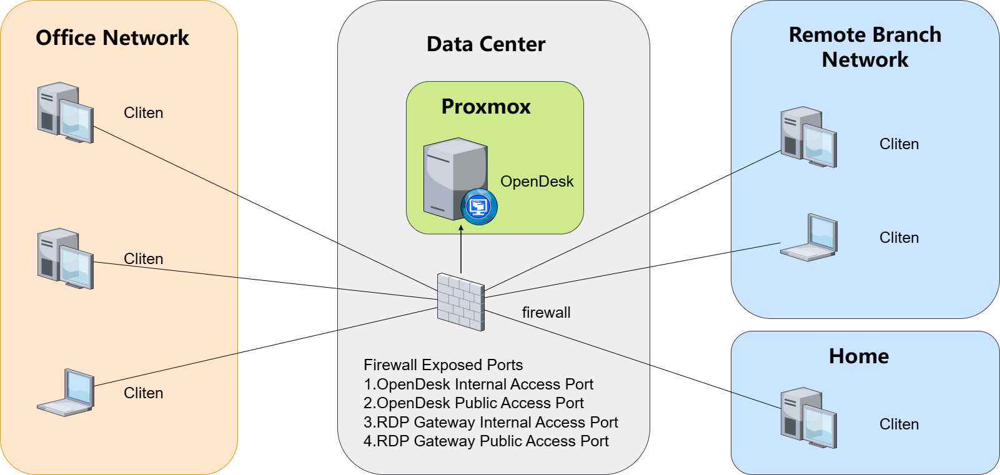

# 🖥️ OpenDesk - SMB VDI Desktop Cloud Solution

## ✨ I. Solution Overview

OpenDesk is a lightweight VDI desktop cloud solution designed for **small and medium-sized enterprises with 10-60 employees**.

Based on:

- OpenDesk VDI Management Platform
- PVE Open Source Virtualization Platform
- RDP Protocol
- Freerdp
- RDPGW Open Source Gateway
- RDPGW Gateway

Building a:

👉 **Low-cost, easy-to-deploy, easy-to-manage unified desktop management system**

By centralizing enterprise desktop environments on servers, employees can access their work desktops via remote connection, enabling true "cloud office."

---

## 🎯 Applicable Scenarios

- 🏢 Small enterprise unified office environment
- 🧑‍💻 Remote work / Work from home / Offsite collaboration
- 📊 Finance / Administration and other data-sensitive positions
- 🧪 Software development / Testing environment isolation
- 🏬 Branch office unified IT management

---

## 🧱 II. Solution Architecture

---

## 🔐 III. Data Security Design

OpenDesk adopts a "data centralization + zero data on terminal" design concept, significantly enhancing enterprise data security:

* 🔒 **Centralized Data Storage**: All business data stored on servers, preventing terminal data leakage
* 🚫 **Zero Data on Terminal**: No core business files saved on employee local devices
* 🧱 **Virtual Machine Isolation**: Each user has independent desktop environment, isolated from others
* 📊 **User Access Policies**: Independent access policies configured for each virtual machine desktop
* 🌐 **Unified Entry Access**: All connections through RDPGW + Guacamole for centralized OpenDesk control

👉 Especially suitable for: Finance, HR, customer data and other sensitive data scenarios

---

## 🌍 IV. Remote Work Capability

OpenDesk natively supports remote work without complex VPN:

* 🌐 Access desktop via client
* 🔑 Unified access through RDPGW + Guacamole (HTTPS)
* 💻 Multi-platform support: Windows / macOS / Linux
* 🚀 Smooth experience even under weak network (RDP protocol optimization)

Employees can:

👉 Access company office environment anytime, anywhere - at home / on business trips / abroad
👉 Achieve true "work from anywhere"

---

## 🧩 V. Detailed Use Cases

### 🏢 1. Enterprise Unified Office Desktop

* All employees use unified system environment and software versions
* Support custom image generation for desktop templates, batch delivery of standard work desktop environments
* Avoid "inconsistent environment across computers" issues

---

### 🧑‍💻 2. Remote Teams

* No need to carry company laptops
* Access work environment from any device
* Reduce IT device management costs

---

### 📊 3. Finance / Administration Positions

* Data never leaves the server
* Reduce risks of USB copy / local data leakage

---

### 🧪 4. Development / Testing Environments

* Quickly create multiple test environments
* Delete after use, avoid pollution
* Support environment isolation

---

### 🏬 5. Branch Office Unified Management

* Headquarters manages all desktops centrally
* No local IT operations required at branches
* Reduce management complexity

---

## 🖥️ VI. Unified Management Capability

OpenDesk provides centralized management capabilities:

* 🧑‍💼 User and desktop unified binding
* 🖥️ Batch VM creation / deletion / start/stop
* 📊 Real-time resource monitoring (CPU / Memory / Online status)
* 📦 Template-based rapid desktop deployment
* 🔄 One-click desktop environment reset

👉 IT administrators can manage all desktop resources through a single web console

---

## ⚡ VII. Minimal Deployment Capability

OpenDesk is designed specifically for SMBs with simple deployment:

* 🧱 Based on PVE virtualization
* 🚀 One-click restore for rapid OpenDesk management platform deployment
* 🌐 Simple RDPGW single-entry configuration
* ⏱️ Typically 15 minutes to deploy batch desktops and go live

Compared to traditional VDI and traditional PCs:

👉 No complex architecture
👉 No specialized virtualization team required
👉 No high implementation costs

---

## 💰 VIII. Cost Advantages

| Item | Traditional VDI | Traditional PC | OpenDesk |
|------|----------------|----------------|----------|
| Software License | High cost | Normal | ✅ 0 license cost |
| Deployment Complexity | High | High | Very low |
| Operational Cost | High | Very high | Low |
| Overall Cost | ❌ Very high | High | ✅ Very low |

👉 Overall cost can be reduced by **70% - 90%**

---

## 📊 IX. Applicable Scale

### 🟢 10-60 Users

* Single server deployment
* 64-512GB memory
* 2-16TB SSD

---
