## OpenDesk 管理员手册

### 一、概述

OpenDesk 是一款基于 Proxmox 的开源 VDI 管理系统。

### 二、登陆

浏览器输入 OpenDesk 虚拟机的 IP 登陆，用户名默认：admin，默认密码：opendesk，支持英、日、中、繁多种语言登陆。

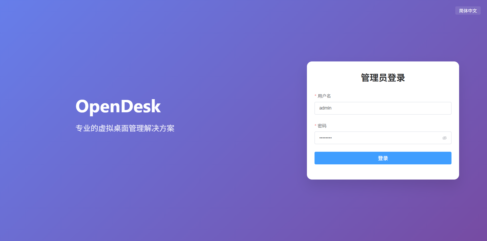

### 三、配置 Proxmox

在系统设置中的 PVE 配置填入相关参数，保存自动重启虚拟机生效。

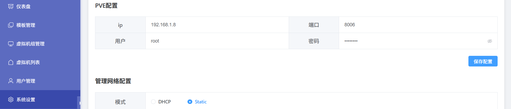

### 四、配置管理系统 IP

在系统设置中的管理网络配置中填入相关参数，推荐配置 Static 模式，保存自动重启虚拟机生效。

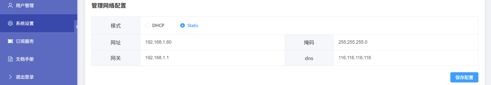

### 五、配置网关代理

默认启用了网关代理服务，为了连接安全，即使网关配置为空，默认连接依然会使用网关，用户在防火墙配置 TCP 端口即可使用，注意把外部代理信息填入。

例如：

公网代理：https://192.168.1.60:9443 -> https://vdi.com:19443

内网代理：https://192.168.1.60:8443 -> https://192.168.1.30:18443

注意：如果使用 nginx 代理，请使用 nginx-full 的 stream 模式。

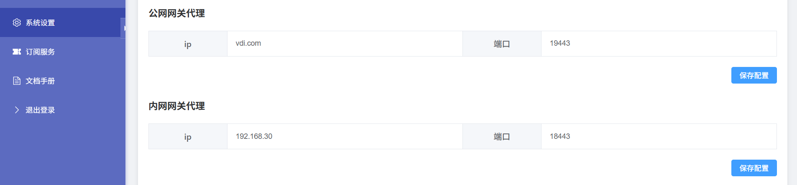

### 六、修改管理员密码

注意：如果你把服务暴露在公网，请一定要修改管理员密码。

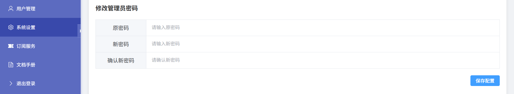

### 七、仪表盘

查看 Proxmox 运行信息。

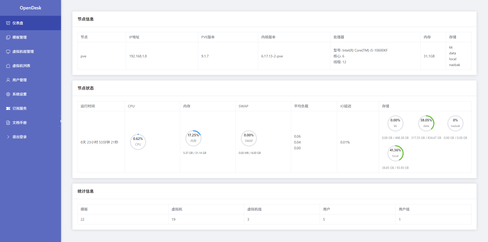

### 八、模板管理

仅支持删除模板。

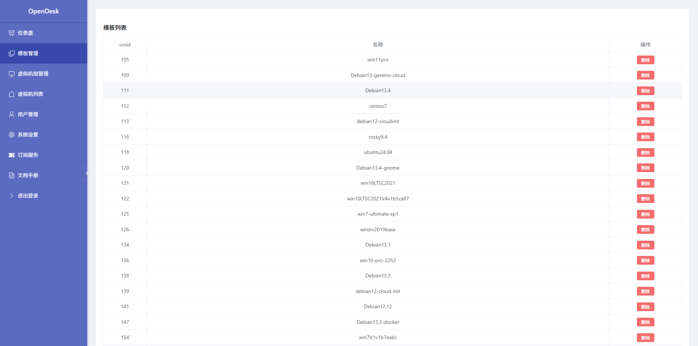

### 九、虚拟机组管理

通过分组便于批量管理虚拟机，可实现创建、还原、重建、删除操作。

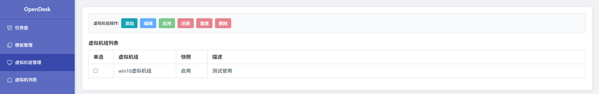

#### 添加虚拟机组

点击添加按钮添加虚拟机组信息。

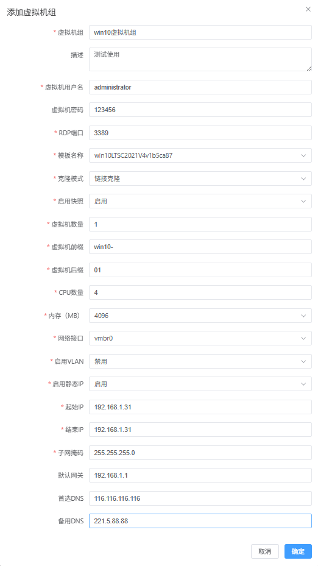

注意：如果虚拟机密码为空，将会生成 16 位随机密码，推荐使用随机密码。

#### 应用虚拟机组

选择需要创建的虚拟机组，点击应用按钮，开始按照配置创建。

#### 还原虚拟机组

如果虚拟机组有快照，点击还原按钮，虚拟机组内所有的虚拟机都会执行还原的操作。

#### 重建虚拟机组

点击重建按钮，虚拟机组内所有的虚拟机都会执行删除，重建创建的操作。

#### 删除虚拟机组

点击删除按钮，虚拟机组内所有的虚拟机都会执行删除的操作。

### 十、虚拟机列表

查看所有虚拟机运行状态，可对虚拟机执行操作。

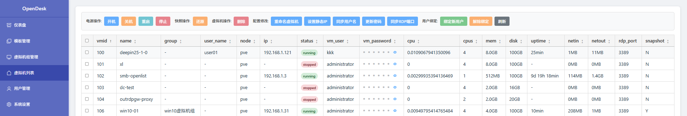

注意：同步用户名和同步 RDP 端口不会修改虚拟机配置，仅同步数据库中的相关配置。

### 十一、用户管理

用户分组管理，统一管理。

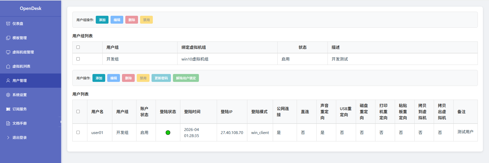

#### 添加用户组

添加用户组，同时绑定虚拟机组

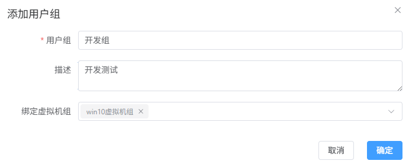

#### 编辑用户组

编辑用户组配置

#### 删除用户组

删除用户组

#### 禁用/启用用户组

禁用或启用用户组

#### 添加用户

批量添加用户，绑定对应用户组，配置连接策略

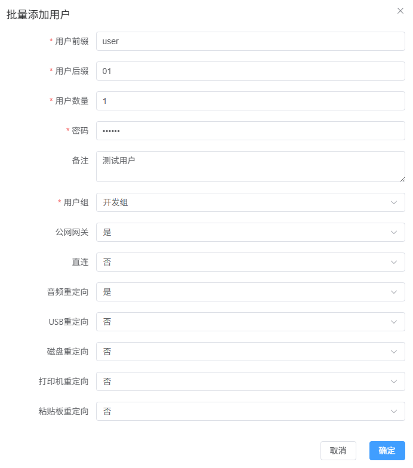
