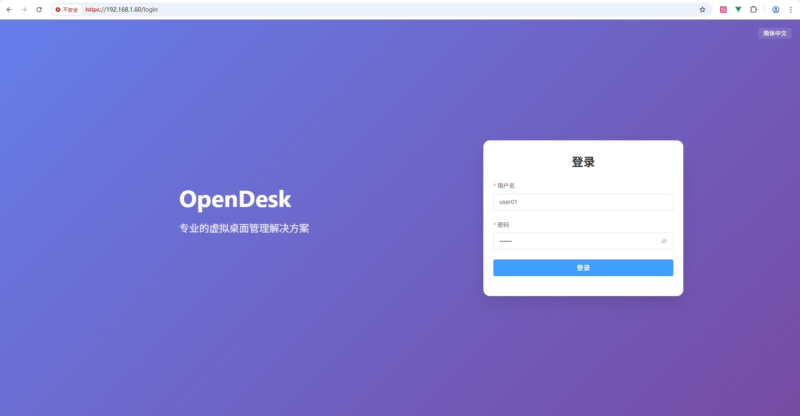
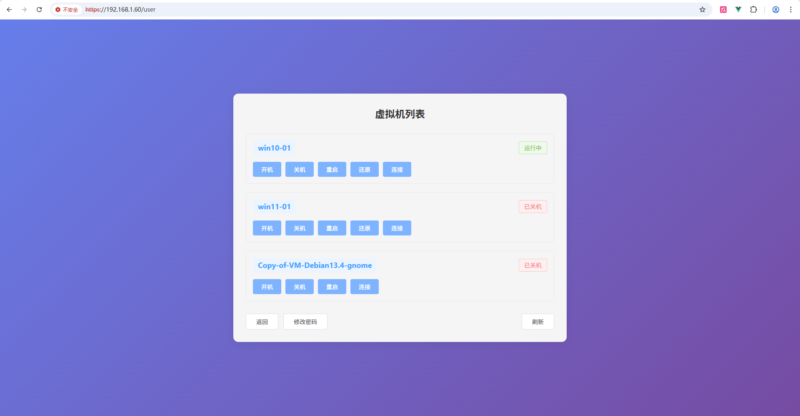
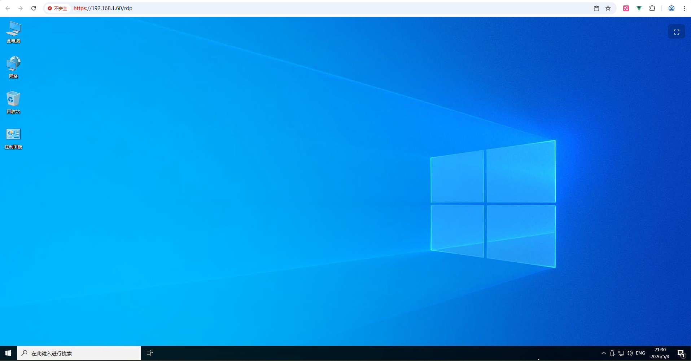
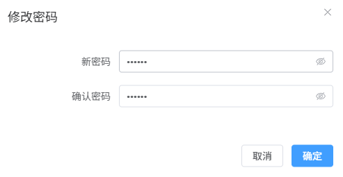
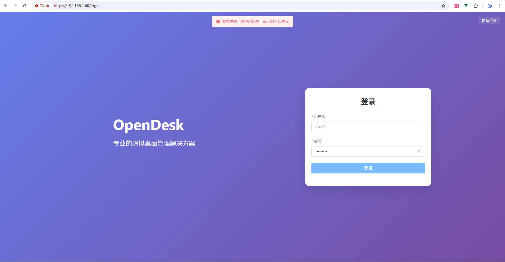

## 浏览器登录模式

### 一、概述

OpenDesk 内置了Guacamole 网关，通过浏览器登陆虚拟机。

### 二、登录

浏览器输入 OpenDesk 的 ip，输入用户名和密码登录。支持英、日、中、繁多种语言登陆。

### 三、连接

点击连接按钮即可登陆虚拟机

点击右边的悬浮按钮，进入全屏模式。浮动按钮支持自由移动。

### 四、修改用户密码

点击修改密码按钮，修改用户密码

### 五、操作虚拟机

点击开机，关机，重启，还原（仅还原模式配置才有）按钮后，通过刷新按钮更新虚拟机状态。虚拟机开机或重启操作后，大约10-15秒用户点击连接才能进入虚拟机，否则会提示连接失败。

### 六、用户锁定

输入5次错误密码，会导致用户被锁定，请联系管理员解锁。

