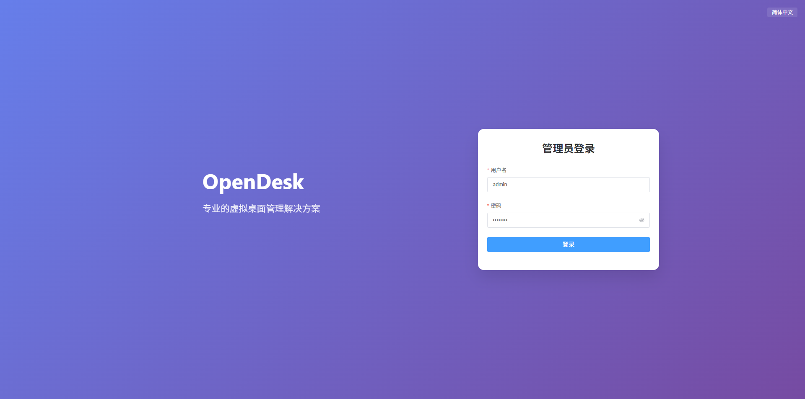

import { Card } from '@site/src/components/ui';

##  OpenDesk

---

## ✨ 产品介绍

<Card>

OpenDesk 致力于为中小规模企业打造轻量、高效且具备良好扩展性的桌面云解决方案。

基于 PVE 虚拟化架构，系统采用模块化设计理念，既保证了部署与使用的简洁性，又具备灵活扩展能力，能够随着业务增长平滑升级。

通过统一的 Web 管理平台，管理员可以集中完成用户、资源与权限的精细化管理，同时实时掌握虚拟机运行状态与用户登录行为。

</Card>

---

## 🔐 安全与运维

<Card>

在安全与性能方面，OpenDesk 集成身份认证与权限控制机制，结合 RD Gateway 网关实现安全访问，有效保障远程桌面连接的稳定与可靠。

系统还提供完善的运维监控与状态感知能力，帮助运维人员快速定位问题并优化资源配置。整体方案在降低部署与运维成本的同时，提升了桌面云环境的可用性与用户体验。

</Card>

---