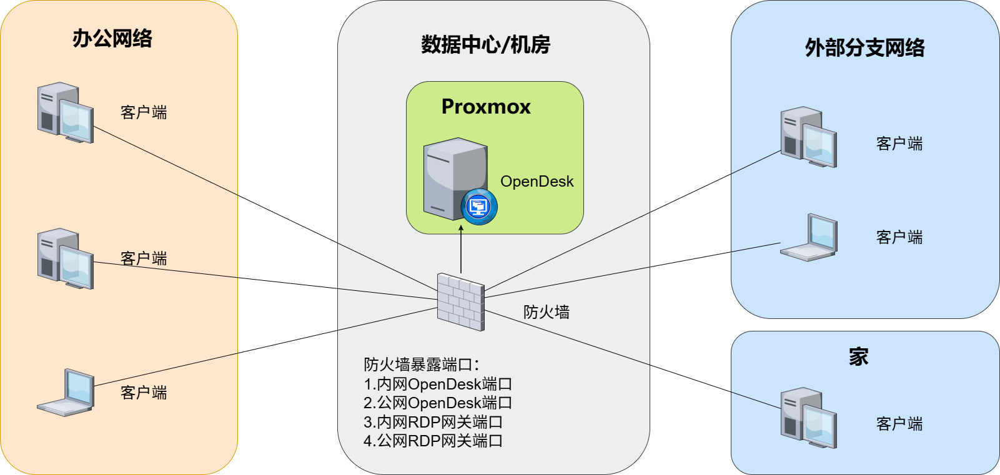

# 🖥️ OpenDesk 中小企业 VDI 桌面云解决方案

## ✨ 一、方案概述

OpenDesk 是一套面向 **10–60 人中小企业**的轻量级 VDI 桌面云解决方案。

基于：

- OpenDesk VDI 管理平台
- PVE 开源虚拟化平台
- RDP 协议
- Freerdp
- RDPGW 开源网关

构建一套：

👉 **低成本、易部署、易运维的统一桌面管理系统**

通过将企业桌面环境集中在服务器端运行，员工只需通过远程连接即可访问自己的工作桌面，实现真正的"云办公"。

---

## 🎯 适用场景

- 🏢 小型企业统一办公环境
- 🧑‍💻 远程办公 / 居家办公 / 异地协作
- 📊 财务 / 行政等高数据敏感岗位
- 🧪 软件开发 / 测试环境隔离
- 🏬 分支机构统一 IT 管理

---

## 🧱 二、方案架构图

---

## 🔐 三、数据安全设计

OpenDesk 采用"数据集中 + 终端无数据"的设计理念，显著提升企业数据安全性：

* 🔒 **数据集中存储**：所有业务数据存放在服务器端，避免终端数据泄露
* 🚫 **终端零数据**：员工本地设备不保存核心业务文件
* 🧱 **虚拟机隔离**：每个用户独立桌面环境，相互隔离
* 📊 **用户访问策略**：为每个用户独立配置访问虚拟机桌面策略
* 🌐 **统一入口访问**：所有连接通过 RDPGW 网关进入，便于 OpenDesk 统一控制

👉 特别适用于：财务、人事、客户资料等敏感数据场景

---

## 🌍 四、远程办公能力

OpenDesk 天然支持远程办公，无需复杂 VPN：

* 🌐 通过客户端即可访问桌面
* 🔑 统一通过 RDPGW（HTTPS）接入
* 💻 支持 Windows / macOS / Linux 多终端
* 🚀 弱网环境下依然流畅（RDP 协议优化）

员工可以：

👉 在家 / 出差 / 外地，随时访问公司办公环境
👉 实现真正"随时随地办公"

---

## 🧩 五、使用场景详解

### 🏢 1. 企业统一办公桌面

* 所有员工使用统一系统环境，统一软件版本
* 支持自定义镜像生成桌面模板，批量交付标准工作桌面环境
* 避免"每台电脑环境不一致"问题

---

### 🧑‍💻 2. 远程办公团队

* 无需携带公司电脑
* 任意设备即可登录工作环境
* 降低 IT 设备管理成本

---

### 📊 3. 财务 / 行政岗位

* 数据不出服务器
* 降低 U 盘拷贝 / 本地泄露风险

---

### 🧪 4. 开发 / 测试环境

* 快速创建多个测试环境
* 用完即删，避免污染
* 支持环境隔离

---

### 🏬 5. 分支机构统一管理

* 总部统一管理所有桌面
* 分支无需本地 IT 运维
* 降低管理复杂度

---

## 🖥️ 六、统一管理能力

OpenDesk 提供集中化管理能力：

* 🧑‍💼 用户与桌面统一绑定
* 🖥️ 虚拟机批量创建 / 删除 / 启停
* 📊 实时监控资源使用情况（CPU / 内存 / 在线状态）
* 📦 模板化快速部署桌面
* 🔄 一键重置桌面环境

👉 IT 管理员可通过一个 Web 控制台管理全部桌面资源

---

## ⚡ 七、极简部署能力

OpenDesk 专为中小企业设计，部署简单：

* 🧱 基于 PVE 虚拟化
* 🚀 一键还原快速部署 OpenDesk 管理平台
* 🌐 RDPGW 单入口配置简单
* ⏱️ 通常 15 分钟部署批量桌面，完成上线

相比传统 VDI 和传统 PC：

👉 无复杂架构
👉 无需专业虚拟化团队
👉 无需高额实施成本

---

## 💰 八、成本优势

| 项目       | 传统 VDI | 传统 PC | OpenDesk     |
| ---------- | -------- | ------- | ------------ |
| 软件授权   | 高额费用 | 正常    | ✅ 0 授权成本 |
| 部署复杂度 | 高       | 高      | 极低         |
| 运维成本   | 高       | 很高    | 低           |
| 总体成本   | ❌ 很高   | 高      | ✅ 极低       |

👉 综合成本可降低 **70% - 90%**

---

## 📊 九、适用规模

### 🟢 10–60 人

* 单台服务器部署
* 64–512GB 内存
* 2-16TB SSD

---
